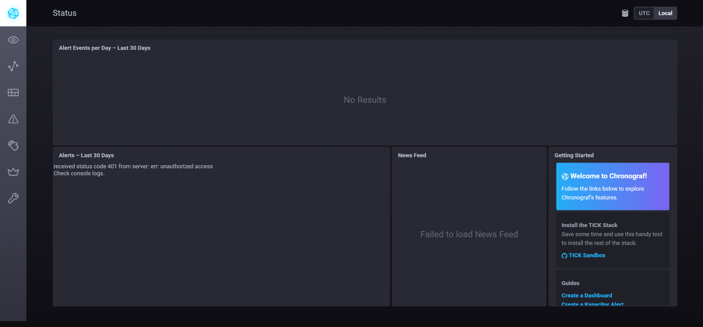
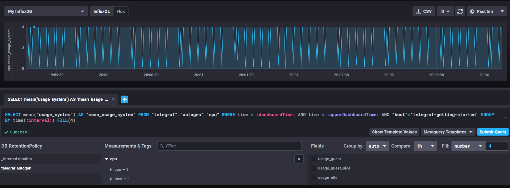
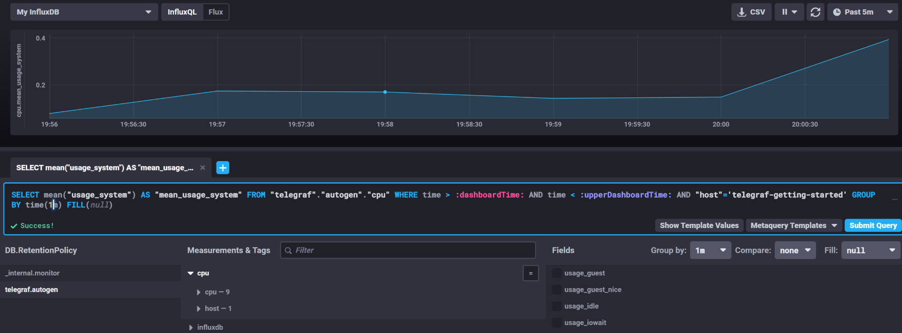
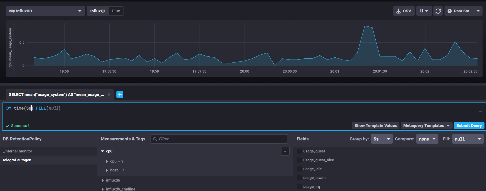
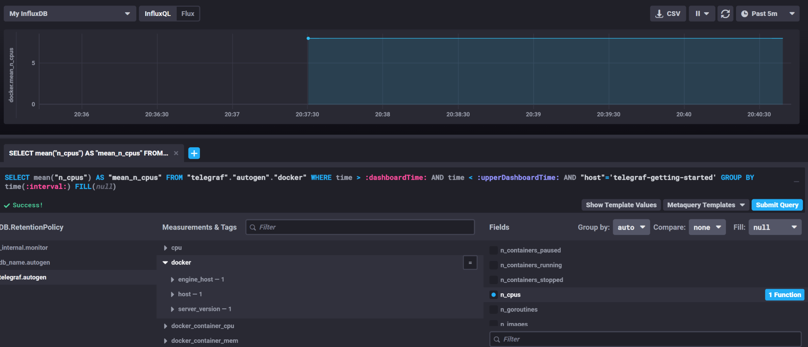

# 1
Вас пригласили настроить мониторинг на проект. На онбординге вам рассказали, что проект представляет из себя 
платформу для вычислений с выдачей текстовых отчетов, которые сохраняются на диск. Взаимодействие с платформой 
осуществляется по протоколу http. Также вам отметили, что вычисления загружают ЦПУ. Какой минимальный набор метрик вы
выведите в мониторинг и почему?

1.Метрики инфраструктуры

**CPU Utilization (%)** – средняя и пиковая загрузка CPU.

Почему: вычисления нагружают процессор, важно следить за его использованием, чтобы избежать перегрузки.

**Температура CPU (если серверы физические)**

Почему: перегрев может приводить к троттлингу и снижению производительности.

**Memory Usage (RAM, Swap)** – потребление оперативной памяти и свопа.

Почему: если вычисления или генерация отчетов используют много памяти, это может привести к OOM-kills или замедлению работы.

**Disk Space (свободное место)** – особенно на разделах, где хранятся отчеты.

Почему: отчеты сохраняются на диск, и его переполнение может привести к сбоям.

**Disk I/O (чтение/запись, latency)** – нагрузка на дисковую подсистему.

Почему: сохранение отчетов требует записи, а высокая задержка может замедлить работу системы.

2.Метрики HTTP-сервиса

**HTTP Request Rate (RPS)** – количество запросов в секунду.

Почему: помогает оценить нагрузку на сервис.

**HTTP Response Time (latency, p50/p95/p99)** – время ответа сервера.

Почему: задержки могут указывать на проблемы с CPU или диском.

**HTTP Error Rate (5xx, 4xx)** – количество ошибок.

Почему: рост ошибок может означать проблемы в работе сервиса.

# 2
Менеджер продукта посмотрев на ваши метрики сказал, что ему непонятно что такое RAM/inodes/CPUla. Также он сказал, 
что хочет понимать, насколько мы выполняем свои обязанности перед клиентами и какое качество обслуживания. Что вы 
можете ему предложить?

Чтобы метрики были полезны менеджеру продукта (PM) и отражали качество обслуживания клиентов, нужно перевести технические показатели в бизнес-ориентированные метрики и SLA/SLO-метрики.

1.Основные бизнес-метрики
A.Доступность сервиса (Availability)
"Сервис доступен" = % успешных HTTP-запросов (2xx/3xx) за период.

Цель (SLA): "Сервис доступен 99.9% времени" (или другой уровень, согласованный с клиентами).

Как измерять: Мониторинг HTTP-кодов ответов (5xx = недоступность).

B.Скорость работы (Performance)
"Среднее время генерации отчета" (в секундах).

"Доля отчетов, сгенерированных быстрее N секунд" (например, 95% отчетов — за 5 сек).

Как измерять: Тайминги от момента запроса до выдачи отчета.

C.Надежность (Reliability)
"Количество потерянных отчетов" (например, из-за ошибок записи на диск).

"Доля успешно сохраненных отчетов" (например, 99.99%).

Как измерять: Сравнение числа

# 3. 
3.Вашей DevOps команде в этом году не выделили финансирование на построение системы сбора логов. Разработчики в свою 
очередь хотят видеть все ошибки, которые выдают их приложения. Какое решение вы можете предпринять в этой ситуации, 
чтобы разработчики получали ошибки приложения?

Локальные логи:

Хранить логи прямо на серверах.

Настроить ротацию логов (logrotate)

Уведомления об ошибках:

Настроить алерты в системе мониторинга Prometheus + Alertmanager, чтобы видеть, когда появляются ошибки.

Отправка логов:

Сделать скрипт, который ищет ошибки и отправляет уведомления по почте или в мессенджеры, например в telegramm

# 4
4.Вы, как опытный SRE, сделали мониторинг, куда вывели отображения выполнения SLA=99% по http кодам ответов. 
Вычисляете этот параметр по следующей формуле: summ_2xx_requests/summ_all_requests. Данный параметр не поднимается выше 
70%, но при этом в вашей системе нет кодов ответа 5xx и 4xx. Где у вас ошибка?

SLA = summ_2xx_requests/summ_all_requests

Если SLA ниже 70%, но при этом ошибок 4xx и 5xx нет, скорее всего есть много запросов, которые возвращают коды 1xx или 3xx. Эти коды не считаются успешными, но включаются в общее число запросов.

Нужно добавить их в числитель:

SLA = (summ_2xx_requests + summ_1xx_requests + summ_3xx_requests)/summ_all_requests

А так-же будет полезным убедиться, что данные метрик собираются и обрабатываются правильно.

# 5
5.Опишите основные плюсы и минусы pull и push систем мониторинга.

**PUSH**

*Плюсы*
- упрощение репликации данных в разные системы мониторинга или их резервные копии
- более гибкая настройка отправки пакетов данных с метриками
- UDP - это менее затратный способ передачи данных, из-за чего  ожет возрасти производительность сбора метри

*Минусы*
- Сложность конфигурации агентов
- Безопасность. Агенты отправляют данные на сервер, что требует открытых портов и дополнительных механизмов аутентификации и шифрования

**PULL**

*Плюсы*
- легче контролировать подлинность данных
- можно настроить единый proxy server до всех агентов с TLS
- упрощённая отладка получения данных с агентов

*Минусы*
- Зависимость от доступности конечной точки:
Если хост временно недоступен, метрики за этот период будут потеряны
- Сервер мониторинга должен опрашивать множество конечных точек, что увеличивает его нагрузку с ростом числа источников данных

# 6
6.Push и Pull модели
- Pull: Prometheus, Nagios
- Push: TICK
- Гибридные: Zabbix, VictoriaMetrics

# 7
Окно интерфейса chronograf

# 8
Метрики CPU

1 min

5 s

# 9
Метрики docker

