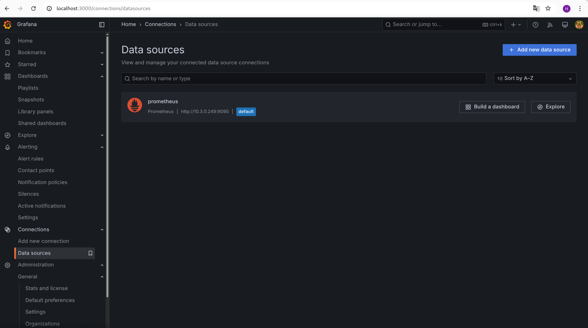
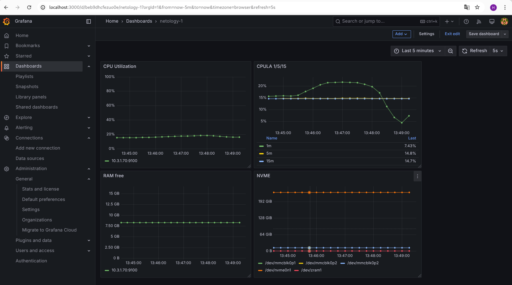

### 1.

Cкриншот веб-интерфейса grafana со списком подключенных Datasource 

### 2.
 
promql-запросы для выдачи метрик:

cpu util: 100 - (avg(rate(node_cpu_seconds_total{mode="idle", instance="10.3.1.70:9100"}[5m])) by (instance) * 100)

cpula 1: 100 - (avg(rate(node_cpu_seconds_total{mode="idle", instance="10.3.1.70:9100"}[1m])) by (instance) * 100)

cpula 5: 100 - (avg(rate(node_cpu_seconds_total{mode="idle", instance="10.3.1.70:9100"}[5m])) by (instance) * 100)

cpula 15: 100 - (avg(rate(node_cpu_seconds_total{mode="idle", instance="10.3.1.70:9100"}[15m])) by (instance) * 100)

ram: node_memory_MemFree_bytes{instance="10.3.1.70:9100"}

size disks: node_filesystem_size_bytes{fstype!="tmpfs",fstype!="fuse.lxcfs", instance="10.3.1.70:9100"}

### 3.

Cкриншот Dashboard

### 4.

[Dashboard файл json](panel.json)